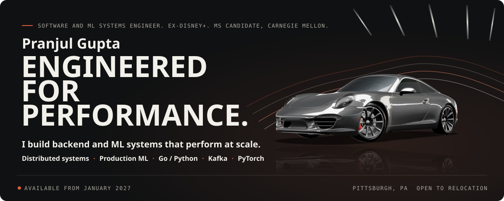
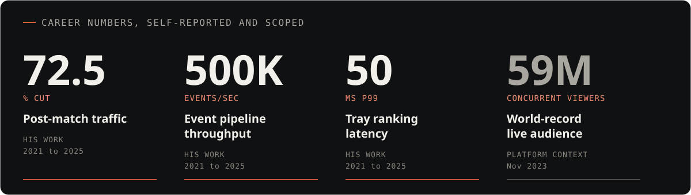
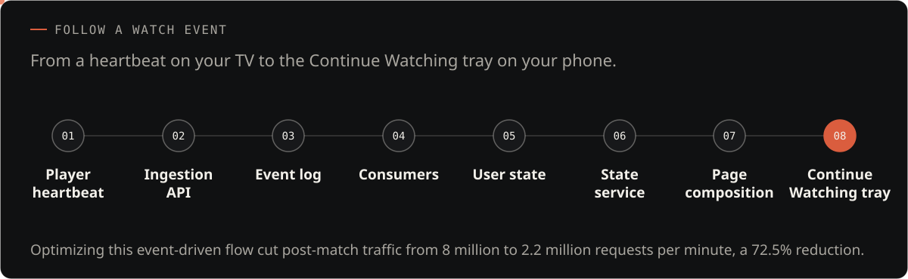
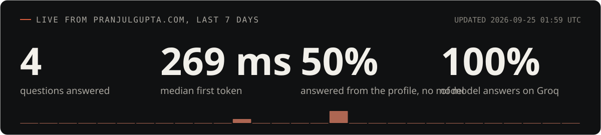
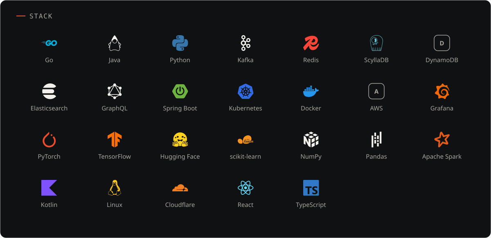

<div align="center">

<a href="https://pranjulgupta.com"></a>

<a href="https://pranjulgupta.com"></a>
<a href="https://pranjulgupta.com/ask"></a>
<a href="https://www.linkedin.com/in/pranjulgupta/"></a>
<a href="https://huggingface.co/PranjulGupta"></a>
<a href="https://pranjulgupta.com/resume.pdf"></a>
<a href="mailto:pranjulg@andrew.cmu.edu"></a>

</div>

Backend and ML systems engineer. Four years at Disney+ (Hotstar, India streaming) owning Continue Watching across phone, TV, and web, and cutting post-match traffic 72.5%, from 8 million requests a minute to 2.2 million. Finishing an MS in AI Engineering at Carnegie Mellon. Open to senior software and AI/ML roles from January 2027.

```yaml
name: Pranjul Gupta
role: Software and ML systems engineer
now: MS, AI Engineering - Information Security, Carnegie Mellon
graduating: December 2026
before: Software Development Engineer II, Disney+ Hotstar, about four years
looking_for: Senior Software Engineer, Senior AI/ML Engineer
available: January 2027
work_authorization: STEM OPT (3 years)
based_in: Pittsburgh, PA, open to relocation
```



<a href="https://pranjulgupta.com/#flow"></a>

### Selected work

| Work | What it is | Result |
| --- | --- | --- |
| **Spanish ASR recipe for ESPnet**<br><sub>WAVLab, Carnegie Mellon University<br><b>Open-source ML / Evaluation and debugging</b></sub> | A Spanish speech recipe for ESPnet, and the evaluation bug that was too good to be true. | Dev WER 24.4%; overall test WER 56.3% under substantial domain and channel shift; 18.9% WER on the 711-utterance spontaneous-answer subset with novel speakers.<br>[PR](https://github.com/espnet/espnet/pull/6491) · [model](https://huggingface.co/PranjulGupta/heroico-asr-conformer-es) |
| **Continue Watching**<br><sub>Disney+<br><b>Distributed systems / End-to-end ownership</b></sub> | The tray that remembers where you stopped, for tens of millions of viewers. | 72.5% fewer home-page requests per minute after a live match (8 million down to 2.2 million in that post-match window). |
| **Two-phase tray ranking**<br><sub>Disney+<br><b>Production ML / Low-latency serving</b></sub> | Ranking 200+ trays per session in 50 ms at p99. | Ranking service p99 latency of 50 ms across 200+ candidate trays per session (service latency, not end-to-end page latency). |
| **pranjulgupta.com**<br><sub>Personal project</sub> | An assistant that can only say what the profile says. | 32 evaluation questions check retrieval and answers, including facts that are not on record (my age, Rust) and prompt-injection attempts, which must not produce an invented fact or the system prompt.<br>[live](https://pranjulgupta.com) · [ask it](https://pranjulgupta.com/ask) |

### Ask about me

The assistant on my site answers only from my published profile and shows which sections it used. Type or talk to it.

<a href="https://pranjulgupta.com/ask"></a>

### Live from the assistant



<sub>Refreshed daily by a GitHub Action from the site's own logs (Cloudflare D1). Site telemetry, not career statistics.</sub>

### Contributions



<sub>The same year GitHub shows below, redrawn daily from GitHub's own calendar. Work in private repositories counts as numbers only.</sub>



---

<sub>Car render in the banner adapted from <a href="https://sketchfab.com/3d-models/free-porsche-911-carrera-4s-d01b254483794de3819786d93e0e1ebf">(FREE) Porsche 911 Carrera 4S</a> by <a href="https://sketchfab.com/karolmiklas">Karol Miklas</a>, <a href="https://creativecommons.org/licenses/by-sa/4.0/">CC BY-SA 4.0</a>. Not affiliated with or endorsed by Porsche. Everything on this page is generated from the same profile file as <a href="https://pranjulgupta.com">pranjulgupta.com</a>.</sub>
